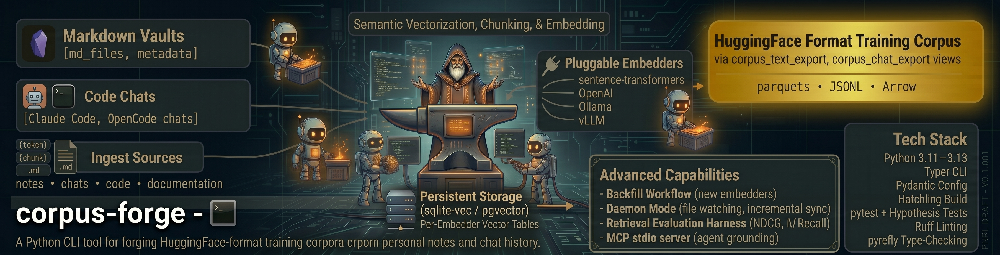

<p align="center">
  
</p>

# corpus-forge

> **Chat with your data. Forge a living, trainable corpus that makes any model smarter.**

[](https://github.com/ulmentflam/corpus-forge/actions/workflows/ci.yml)
[](https://github.com/ulmentflam/corpus-forge/actions/workflows/nightly.yml)
[](https://www.python.org/)
[](LICENSE)
[](https://github.com/ulmentflam/corpus-forge/releases)
[](https://github.com/astral-sh/ruff)
[](https://github.com/facebook/pyrefly)

## Why corpus-forge

- **Chat with your data. Build a living corpus.** Point corpus-forge at your notes, code, PDFs, chat history, audio, and video, and you get a searchable index that grows as you (or an AI assistant) curate it. The corpus is the product — *and* it's the upstream of every training run.
- **Training data is the deliverable.** A HuggingFace-Datasets-format export of your text + chat sources, deduplicated by content-hash, ready to feed a fine-tuning run. The living corpus is the way you get there.
- **Human-in-the-loop curation.** Your model finds the weakest entries — low classifier confidence, thin metadata, missing labels — and you fortify them in a chat with Claude, Gemini, or OpenCode. Edits commit back through MCP, so the next training run starts from stronger data. See [`AGENTS.md`](AGENTS.md) for the vendor-neutral playbook.
- **Universal multi-format ingest.** Markdown, PDF (digital + VLM OCR escalation), HTML, EPUB, Office (`.docx`/`.pptx`/`.xlsx`), Jupyter notebooks, CSV, structured data (JSON/YAML/TOML), subtitles, 45+ source-code languages via tree-sitter, images via a VLM, and audio/video via Whisper — all behind a single `filesystem` source plugin.
- **Content-defined chunking + classification + enrichment.** Documents are classified into a 9-value content-class taxonomy (rule classifier → optional LLM escalation), chunked by class (FastCDC for prose, AST-aware for code, conversation-aware for chat), and code chunks are optionally enriched with LLM-synthesised docstrings + summaries + symbol references.
- **Multi-embedder by design.** Register as many text embedders as you want — local sentence-transformers, OpenAI, anything served via an OpenAI-compatible endpoint (Ollama, vLLM). Multi-modal embedders (CLIP family) cover the image lane. Backfill new embedders without re-chunking.
- **Local-or-remote, end to end.** Every model client (VLM, classifier, Whisper, code enricher, reranker) accepts a configurable HTTP URL — default is a local Ollama daemon, swap to a hosted endpoint with a one-line config change and no code edit.
- **Predictable storage.** `corpus-forge estimate <path>` predicts the Postgres footprint of syncing a tree *before* you sync. Same surface available to any MCP-connected assistant via `estimate_sync_size`.

## Install

### One-liner (recommended)

The installer walks you through a short prompt-tree, picks the right
pip extras for the components you want, runs `uv tool install`, and
hands off to the `corpus-forge setup` wizard to render
`~/.config/corpus-forge/config.toml`. Works on macOS, Linux, and
Windows.

```bash
# macOS / Linux / WSL
curl -sSf https://raw.githubusercontent.com/ulmentflam/corpus-forge/main/install.sh | sh
```

```powershell
# Windows (run from an elevated PowerShell if you also want the daemon service)
iwr -useb https://raw.githubusercontent.com/ulmentflam/corpus-forge/main/install.ps1 | iex
```

**CI / unattended installs** — set `CF_NON_INTERACTIVE=1` plus the
`CF_*` env vars documented in [`corpus_forge/setup/questions.toml`](corpus_forge/setup/questions.toml):

```bash
CF_NON_INTERACTIVE=1 CF_BACKEND=sqlite CF_MCP=yes CF_HF=yes \
  curl -sSf https://raw.githubusercontent.com/ulmentflam/corpus-forge/main/install.sh | sh
```

### Install with Claude (copy-paste prompt)

Already living in Claude Code, Claude Desktop, or another MCP client?
Skip the manual steps — let the assistant do the whole install *and*
the MCP wiring. Paste this prompt and answer the two questions it asks:

```
Following this repo's CLAUDE.md end to end, do the full corpus-forge install + MCP wiring for me.
1. Install corpus-forge, picking the right method for my platform.
2. Run `corpus-forge setup`, then `corpus-forge migrate`.
3. Wire it up as an MCP server in whatever client I'm running
   right now — Claude Code (.mcp.json), Claude Desktop config, or the
   Anthropic Agent SDK — using the exact server block from CLAUDE.md.
4. Register the `corpus-forge-search` and `corpus-curate` skills.
5. Run the first-run sanity sequence (migrate → doctor → estimate →
   ingest → embed → search) on the small corpus path I give you.
If you're not a Claude client, follow AGENTS.md instead.
Ask me for my backend (postgres or sqlite) and my corpus path before
you start if I haven't already told you.
```

`CLAUDE.md` is the canonical guide the assistant follows;
[`AGENTS.md`](AGENTS.md) (any MCP client) and [`GEMINI.md`](GEMINI.md)
(Gemini CLI / Code Assist) are the equivalents for non-Claude clients.

### Upgrade + diagnostics

```bash
corpus-forge update    # auto-detects channel (uv-tool / pipx / brew / docker / source / pip)
corpus-forge doctor    # post-install health check (Python, system deps, config)
corpus-forge --version # prints version; daily PyPI ping surfaces newer releases
```

The `--version` ping is strictly anonymous (User-Agent
`corpus-forge/<version>`, no install-id) and caches the result for
24 h. Opt out with `CF_NO_VERSION_CHECK=1`.

### Distribution channels

- **Homebrew tap** — `brew install ulmentflam/tap/corpus-forge`
  (formula scaffold at [`packaging/distribution/corpus-forge.rb`](packaging/distribution/corpus-forge.rb))
- **Scoop bucket** — manifest scaffold at [`packaging/distribution/corpus-forge.json`](packaging/distribution/corpus-forge.json)
- **Docker** — `docker run -it ghcr.io/ulmentflam/corpus-forge:latest --help`
  (see [`Dockerfile`](Dockerfile); `:full` tag bundles every extra)
- **PyPI** — `pip install corpus-forge` or `uv tool install corpus-forge`

### Advanced: manual install with hand-picked extras

<details>
<summary><strong>Linux</strong></summary>

```bash
# 1. Install the package + the extras you need.
pip install 'corpus-forge[sqlite,hf]'
#   common adds:
#     [code]         tree-sitter code chunker + 45+ language extractor
#     [multi-format] PDF / HTML / EPUB / Office / Notebook / CSV + FastCDC chunker
#     [ocr]          VLM OCR for sparse-text PDFs + image extractor
#     [whisper]      audio + video transcription (faster-whisper / OpenAI / Groq)
#     [mcp]          Model Context Protocol stdio server for Claude / Agent SDK
#     [rerank]       cross-encoder reranker (BGE default)
#     [eval]         retrieval-evaluation harness

# 2. (Optional) Register a systemd user unit for the daemon.
bash scripts/linux/install.sh
# Writes ~/.config/systemd/user/corpus-forge.service and starts it
# via `systemctl --user enable --now corpus-forge.service`.

# 3. Configure + smoke-test.
cp config.example.toml  ~/.config/corpus-forge/config.toml
cp secrets.env.example ~/.config/corpus-forge/secrets.env
corpus-forge migrate
corpus-forge ingest --once
```

</details>

<details>
<summary><strong>macOS</strong></summary>

```bash
# 1. Install (same as Linux).
pip install 'corpus-forge[sqlite,hf]'

# 2. (Optional) Register a launchd agent for the daemon.
bash scripts/macos/install.sh
# Renders ~/Library/LaunchAgents/com.${USER}.corpus-forge.plist and
# prints the `launchctl load` / `launchctl kickstart` commands.

# 3. Configure + smoke-test.
cp config.example.toml  ~/.config/corpus-forge/config.toml
cp secrets.env.example ~/.config/corpus-forge/secrets.env
corpus-forge migrate
corpus-forge ingest --once
```

Apple Silicon: `device = "mps"` in the embedder config uses the GPU.

</details>

<details>
<summary><strong>Windows</strong></summary>

`pip install corpus-forge[sqlite,hf]` works under Python 3.11/3.12/3.13 on Windows. We don't ship a Windows service-installer script for beta — wrap `corpus-forge daemon` with [NSSM](https://nssm.cc/) or Task Scheduler:

```powershell
# Example with NSSM
nssm install corpus-forge "C:\Path\To\Python\python.exe" -m corpus_forge daemon
nssm set corpus-forge AppDirectory "%USERPROFILE%\.config\corpus-forge"
nssm start corpus-forge
```

PostgreSQL integration tests require Docker Desktop; SQLite-only setups work natively.

</details>

### Source install (developer mode)

```bash
git clone https://github.com/ulmentflam/corpus-forge
cd corpus-forge
make dev    # uv sync --all-extras --group dev + pre-commit install
make ci     # full local gate (format / lint / typecheck / tests)
```

## Quickstart

```bash
pip install corpus-forge[sqlite,hf]

# 1. Drop in a config (edit paths + embedder choices).
mkdir -p ~/.config/corpus-forge
cp $(python -c "import corpus_forge, pathlib; print(pathlib.Path(corpus_forge.__file__).parent.parent / 'config.example.toml')") \
   ~/.config/corpus-forge/config.toml
$EDITOR ~/.config/corpus-forge/config.toml

# 2. Initialize the database (SQLite or PostgreSQL).
corpus-forge migrate

# 3. (Optional) Drop a .corpusignore at the scan root to skip noisy
#    files/dirs. A vendor-neutral starter ships at .corpusignore.example.
#    User-global rules can live at ~/.config/corpus-forge/ignore.

# 4. Estimate the Postgres footprint *before* you sync. No I/O, no model calls.
corpus-forge estimate ~/Notes

# 5. Run a one-shot ingestion pass.
#    No corpus of your own yet? Point a source at examples/sample-corpus/
#    — a ready-made mini knowledge base — and follow its README.
corpus-forge ingest --once

# 6. Backfill embeddings for the active embedder(s).
corpus-forge embed -e qwen3_8b

# 7. (Optional) Classify documents into the 9-value content-class taxonomy.
corpus-forge classify --dry-run --json
corpus-forge classify

# 8. (Optional) Re-chunk classified prose with FastCDC + AST-aware code.
corpus-forge rechunk

# 9. Search the corpus end-to-end.
corpus-forge search "how does the SQLite lock work" --k 5

# 10. Curate weak entries with an AI assistant (Claude / Gemini / OpenCode).
#     Wire the MCP server (see "For AI assistants" below), then in your chat:
#     /corpus-curate    →  next_curation_target → chat → commit_curation

# 11. Export to HuggingFace Datasets format.
corpus-forge export chat --dataset claude-code --out ./chat.jsonl --template chatml
```

## What you get — HF export

The headline payoff. Two views map directly to HuggingFace columns. The
Python API is the supported surface; the `corpus-forge export chat` CLI
covers the most common chat-side path (with chat-template + ShareGPT
shaping):

```python
from corpus_forge.exports.huggingface import export_to_hf_dataset, push_to_hub

# Text view — one row per chunk, suitable for instruction-tuning prep.
ds = export_to_hf_dataset("corpus_text_export")

# Chat view — one row per conversation, ShareGPT-shaped `messages` list.
ds_chat = export_to_hf_dataset("corpus_chat_export")

push_to_hub(ds, "username/my-personal-corpus")
```

For chat exports with chat-template rendering (ChatML, Llama-3, Gemma, custom
Jinja):

```bash
corpus-forge export chat --dataset claude-code \
    --out ./chat.jsonl --template chatml --format jsonl
corpus-forge export feedback-pairs --dataset claude-code \
    --out ./feedback.jsonl
```

| View | Columns |
|---|---|
| `corpus_text_export` | `id`, `text`, `source`, `title`, `heading`, `role`, `metadata`, `labels` |
| `corpus_chat_export` | `id`, `source`, `title`, `messages` (ShareGPT format), `metadata` |

## Hardware acceleration

| Platform | Backend | Embedder device |
|---|---|---|
| Linux + CUDA | `postgres` (pgvector) or `sqlite` (sqlite-vec) | `device = "cuda"` |
| macOS Apple Silicon | `postgres` or `sqlite` | `device = "mps"` |
| Linux/Windows CPU | either | `device = "cpu"` |
| Anywhere | sqlite-only, no GPU | `device = "cpu"` |

Set `device = "auto"` to let sentence-transformers pick.

## Embedding model recommendations

corpus-forge is multi-embedder by design — declare several `[[embedders]]`
blocks and backfill them independently. The picks below are the condensed
headline of [`docs/embedding-models.md`](docs/embedding-models.md), which
carries the full per-lane survey, tradeoffs, and sources. These rankings are
literature-grounded (HF Hub + live MTEB/MMTEB/CoIR/ViDoRe); empirical
on-machine rankings against *your* corpus are pending the
`corpus-forge eval embedders` run, which should break any close tie.

| Lane | Default (quality) | Fast / local | API |
|---|---|---|---|
| **English text** | Qwen3-Embedding-8B | Qwen3-Embedding-0.6B / BGE-large-en-v1.5 | OpenAI text-embedding-3-large |
| **Code** | nomic-embed-code | potion-code-16M (static fast tier) | Voyage voyage-code-3 |
| **Multilingual** | Qwen3-Embedding-8B | multilingual-e5-large-instruct | Cohere embed-multilingual-v3 |
| **Multimodal** | SigLIP 2 (so400m) | nomic-embed-vision-v1.5 | Voyage voyage-multimodal-3 |

The Qwen3 family (Apache-2.0) is the safe local default for prose, code, and
100+ languages alike; `potion-code-16M` is a CPU-instant *fast tier* you wire
in front of a dense embedder (`[retrieval].fast_tier_embedder_name`), not a
standalone index. **Watch licensing:** `jinaai/jina-embeddings-v3` and
`jinaai/jina-clip-v2` are **CC-BY-NC-4.0 (non-commercial)** — flag before
shipping a product. Copy-paste blocks for the headline picks (field format
matches [`config.example.toml`](config.example.toml)):

```toml
# English / multilingual quality default — needs a GPU (~16 GB+).
[[embedders]]
name      = "qwen3_8b"
provider  = "sentence_transformers"
model_id  = "Qwen/Qwen3-Embedding-8B"
dimension = 4096
normalize = true
distance  = "cosine"
active    = true

# Static fast tier — CPU-instant, ~16 MB. Point
# `[retrieval].fast_tier_embedder_name` at this name; not a sole index.
[[embedders]]
name      = "potion_code_16m"
provider  = "model2vec"
model_id  = "minishlab/potion-code-16M"
dimension = 256
normalize = true
distance  = "cosine"
active    = true

# Managed API — set OPENAI_API_KEY (or `base_url` for any OpenAI-compatible host).
[[embedders]]
name        = "openai_3l"
provider    = "openai"
model_id    = "text-embedding-3-large"
dimension   = 3072
normalize   = true
distance    = "cosine"
active      = false
api_key_env = "OPENAI_API_KEY"
```

Add a block, keep existing embedders `active`, then
`corpus-forge embed --embedder <name>` encodes only the missing vectors.

## Optional extras

```bash
pip install 'corpus-forge[sqlite,hf,tokens,retrieval,rerank,mcp,eval,code,multi-format,ocr,whisper]'
```

The `openai` SDK is a **base dependency** (not an extra) — corpus-forge
uses it for every OpenAI-compatible endpoint, including local Ollama at
`:11434/v1`, vLLM, llama.cpp's server, and LM Studio. The
`[openai]` extra is kept as a no-op back-compat alias so existing
install scripts don't break, but you do not need to add it.

| Extra | What it enables |
|---|---|
| `[sqlite]` | `sqlite-vec` virtual table for ANN search on SQLite. |
| `[hf]` | `datasets` library for HF export. |
| `[tokens]` | `tiktoken` for token-aware chunking. |
| `[retrieval]` | NumPy-backed retrieval-evaluation primitives. |
| `[rerank]` | `sentence-transformers` cross-encoder rerankers (BGE default). |
| `[mcp]` | Model Context Protocol stdio server for Claude / Agent SDK clients. |
| `[eval]` | Bundled gold-set evaluation harness (NDCG / MRR / Recall). |
| `[code]` | `tree-sitter` + `tree-sitter-language-pack` for the `CodeChunker` and language-aware code ingest. Apache-2.0 / MIT. |
| `[multi-format]` | PDF / HTML / EPUB / Office / Notebook / CSV / FastCDC chunker — **includes AGPL-3.0 components**. See [Distribution / licensing](#distribution--licensing). |
| `[ocr]` | VLM OCR HTTP clients (`requests`) + PDF rasterisation (`pdf2image`, `pillow`). Needs system `poppler-utils` (see "Distribution / licensing"). Permissive. |
| `[whisper]` | Audio + video transcription via `faster-whisper` (local) or any OpenAI-compatible `/audio/transcriptions` endpoint (remote). Bundles `imageio-ffmpeg`. Permissive. |
| `[fast-tier]` | Static-embedding fast tier (`model2vec` / `minishlab/potion-code-16M`) for the Phase N Wave 3 candidate-generator front-end of `HybridRetriever`. MIT. ~16 MB model weights downloaded on first use. Default search behaviour unchanged until the user opts in via `SearchOptions.fast_tier_mode`. |
| `[analyze]` | Phase O EDA + corpus-cleaning ML stack: `scikit-learn`, `hdbscan`, `umap-learn`, `bertopic`, `datasketch`, `fasttext-langdetect`, `langdetect`. All permissive (BSD-3/MIT/Apache-2.0). Lazy-imported inside `corpus_forge/analyze/` — does NOT widen the AGPL surface and does not affect cold-start time. |

## Distribution / licensing

Corpus-forge's core is permissively licensed (Apache-2.0), but two of the Phase D
multi-format extractors depend on AGPL-3.0 libraries. The license posture of an
installed copy depends on which extras you pull in:

| Install | Effective license | Notes |
|---|---|---|
| `pip install corpus-forge` | **Apache-2.0** | Pure core. Markdown vault + chat history sources only; no PDF / EPUB / Office ingest. |
| `pip install corpus-forge[code]` | **Apache-2.0 + MIT** | Adds the `CodeChunker` and the `CodeExtractor`. Dependencies (`tree-sitter`, `tree-sitter-language-pack`) are Apache-2.0 / MIT — no copyleft contamination. |
| `pip install 'corpus-forge[multi-format]'` | **AGPL-3.0** (effective) | Pulls in `pymupdf4llm` (AGPL-3.0) for digital PDF extraction and `ebooklib` (AGPL-3.0) for EPUBs. AGPL's network-use clause binds your application if you redistribute or expose it as a service. |
| `pip install 'corpus-forge[ocr]'` | Apache-2.0 + permissive HTTP clients | Adds the Ollama / Mistral OCR HTTP clients (`requests`, Apache-2.0), the rasterisation step (`pdf2image`, MIT) and `pillow` (HPND). No further copyleft entanglement on top of `[multi-format]`. **Requires a system `poppler-utils` install** — see "System requirements for `[ocr]`" below. |
| `pip install 'corpus-forge[whisper]'` | Apache-2.0 + MIT + BSD-2 | Adds `faster-whisper` (MIT) for the local backend, `imageio-ffmpeg` (BSD-2) which bundles an ffmpeg binary invoked as a subprocess (the documented LGPL boundary), and `requests` for the remote OpenAI-compatible path. No AGPL widening. |

**Practical guidance.** If you plan to redistribute corpus-forge or a derived
application, stay on pure-core or pure-core + `[code]` — both are
Apache-2.0-clean. If you are using it personally or inside your organisation,
`[multi-format]` is fine; the AGPL surface only matters once you ship the binary
to someone else or expose it as a network service.

The `[multi-format]` choice was made deliberately on 2026-05-14 to keep the
quality-of-extraction story competitive (Docling for Office, `pymupdf4llm` for
PDFs with text layers, `ebooklib` for EPUBs). The alternatives that would have
kept the install Apache-2.0 — `marker-pdf`, `MinerU` — are themselves GPL/AGPL,
so the trade-off is not avoidable today.

### System requirements for `[ocr]`

The `[ocr]` extra adds a single non-Python system dependency:
[`poppler-utils`](https://poppler.freedesktop.org/) (BSD-licensed), used by
`pdf2image` to rasterise PDF pages for the VLM OCR escalation path. Install it
once per machine:

| Platform | Command |
|---|---|
| macOS (Homebrew) | `brew install poppler` |
| Debian / Ubuntu | `sudo apt-get install -y poppler-utils` |
| Fedora / RHEL | `sudo dnf install -y poppler-utils` |
| Windows | Download a build from the [GnuWin32 page](https://blog.alivate.com.au/poppler-windows/) and add it to `PATH`. |

When `poppler-utils` is missing the PDF extractor degrades gracefully back to
the digital-only Tier 1 path with an `ERROR`-level log entry pointing here —
ingest does not break.

The `[ocr]` extra is intentionally light — `requests` (Apache-2.0),
`pdf2image` (MIT), `pillow` (HPND, permissive). It does **not** vendor or
bundle any model weights. Both OCR backends communicate over HTTP: the local
path talks to your Ollama daemon (e.g. `qwen2.5vl:7b`, pulled separately via
`ollama pull`), and the remote path talks to the Mistral OCR API
(`MISTRAL_API_KEY` in `secrets.env`). Adding `[ocr]` does not widen the AGPL
surface introduced by `[multi-format]`.

### Model endpoints (local vs remote)

Every model client in corpus-forge accepts an arbitrary HTTP URL via config.
The default is `http://localhost:11434` (a local Ollama daemon for Ollama-shape
clients) or `https://api.openai.com/v1` (for OpenAI-shape clients), but the
same backends work against any compatible endpoint — hosted Ollama, vLLM,
llama.cpp's OpenAI shim, Groq, Together, DeepInfra, Fireworks, or a self-hosted
mirror. Five clients follow this rule today:

| Surface | Config field | API shape |
|---|---|---|
| VLM (PDF Tier-2 OCR + image extractor) | `vlm.ollama_url` / `vlm.mistral_base_url` | Ollama `/api/generate` or Mistral `/v1/ocr` |
| Document classifier (LLM half) | `classifier.llm_url` | Ollama `/api/generate` |
| Whisper transcription (remote) | `whisper.remote_base_url` | OpenAI-compat `/audio/transcriptions` |
| Multi-modal embedder (remote) | constructor arg on `ClipRemoteEmbedder` | OpenAI-compat `/v1/embeddings` |
| Code enricher (remote) | `code_enricher.remote_url` + `code_enricher.remote_api_shape` | Ollama `/api/generate` OR OpenAI `/chat/completions` |

The local default keeps every ingest run self-contained; pointing at a remote
URL is a one-line config change with no code edit required. Useful when
classification, OCR, transcription, or enrichment should run on a beefier host
than the laptop doing the ingest.

## Document classification

Phase E (`corpus-forge classify`) walks every ingested document and attaches
a **content-class** strong label from a nine-value enum — `code`, `chat`,
`book`, `textbook`, `paper`, `article`, `reference`, `note`, `other`. The
label powers subset selection at training time ("give me all chat docs",
"hold out textbook for eval") and is persisted on `corpus.document_labels`
with `source = 'classifier:rule' | 'classifier:llm' | 'user'`.

| value | what it covers |
|---|---|
| `code` | source code, scripts, build files (Makefile, Dockerfile), config-as-code |
| `chat` | conversation transcripts (Claude Code, OpenCode, generic dialogue) |
| `book` | long-form non-pedagogical — fiction, memoir, popular non-fiction |
| `textbook` | long-form pedagogical — academic textbook, course notes, exercises |
| `paper` | research / academic papers (PDFs with abstract + citations) |
| `article` | blog posts, magazine articles, news, opinion writing |
| `reference` | API docs, schema specs, manifests, JSON/YAML/TOML/CSV |
| `note` | personal notes — Obsidian vault, markdown jottings, journals |
| `other` | fallback when no signal is strong enough to commit |

The default chain is `["rule", "llm"]`: a stdlib rule classifier
(microseconds/doc) short-circuits high-confidence documents, and the LLM
classifier (Ollama `qwen2.5:7b-instruct` by default; ~5–10 s/doc on M-series)
picks up the weak / ambiguous cases. The escalation threshold defaults to
`0.4` — rule confidences below that bar trigger the LLM call.

The LLM classifier follows the **local-or-remote** principle described
above: `classifier.llm_url` defaults to `http://localhost:11434` and accepts
any Ollama-compatible URL. Tune the chain, threshold, and endpoint in the
`[classifier]` block of `config.toml`.

```bash
corpus-forge classify --dry-run --json    # preview the plan, one JSON line per doc
corpus-forge classify                     # apply labels
corpus-forge classify --classifier rule   # bypass the LLM (rule classifier only)
```

The CLI prints a cost-guard preflight with a worst-case LLM-call estimate
before the run starts; `--limit N` and `--dataset NAME` are available for
quick smoke tests.

## Content-defined chunking + rechunk

Phase F replaces positional chunk slicing for prose classes (`book`,
`textbook`, `paper`, `article`, `note`, `other`) with **FastCDC**
content-defined boundaries. Mid-document edits ripple at most 2-3
chunks instead of shifting every downstream boundary, and the
Phase C `chunks.content_hash` embedding-reuse path achieves its
design potential — most chunks survive a small edit byte-identical.

`corpus-forge rechunk` re-runs the chunker pass against documents that
already carry a `class=*` label (run `corpus-forge classify` first). The
class-mapped chunker resolves to:

| class | chunker | notes |
|---|---|---|
| `code` | `CodeChunker` | tree-sitter AST when available, byte-line fallback otherwise |
| `chat` | `ConversationChunker` | per-message or sliding-window |
| `reference` | `PassthroughChunker` | structured docs round-trip as-is |
| `book` / `textbook` / `paper` / `article` / `note` / `other` | `CDCChunker` | FastCDC rolling hash |

The rechunk pass is idempotent on chunk-text **and** chunker signature
(`metadata.cdc_fingerprint`, `metadata.byte_range`) — re-running after
a green pass is a no-op.

## Audio / video transcription

Phase G P0 routes `.mp3`/`.wav`/`.m4a`/`.ogg`/`.flac` and
`.mp4`/`.mov`/`.webm`/`.mkv`/`.avi` files through a Whisper-family
transcription model. Output is markdown (with timestamp anchors on the
local backend), folded into the same `documents` row family as any
other extractor.

Two backends ship behind the `[whisper]` extra:

- `backend = "local"` → in-process `faster-whisper` (tiny / base / small /
  medium / large; `small` default). Bundles `imageio-ffmpeg` for the
  audio extraction step.
- `backend = "remote"` → any OpenAI-compatible `/audio/transcriptions`
  endpoint (OpenAI `whisper-1`, Groq `whisper-large-v3`, self-hosted
  whisper.cpp via HTTP). Same local-or-remote URL principle — swap
  `whisper.remote_base_url` to a different provider with no code change.

Default `backend = "none"` keeps existing configs untouched: audio /
video files are silently skipped until the user opts in via the
`[whisper]` config block.

## Multi-modal embeddings

Phase G P1 adds a separate **`MultiModalEmbedder`** protocol alongside
the text `Embedder`. Image chunks (`metadata.image_path` or
`metadata.image_b64`) get vectorised into a dedicated
`image_embeddings_<name>` per-embedder table that mirrors the existing
text family.

```bash
# Backfill the default CLIP local embedder against image chunks.
corpus-forge embed -e clip_local --image
```

Two backends ship out of the box:

- `ClipLocalEmbedder` — sentence-transformers `clip-ViT-B-32` (512 d,
  ~150 MB, MIT). Default.
- `ClipRemoteEmbedder` — any OpenAI-compatible `/v1/embeddings`
  endpoint that accepts base64 data-URL image input (Voyage AI's
  `voyage-multimodal-3`, Cohere `embed-v3-multimodal`, or a self-hosted
  CLIP service).

Cross-modal cosine similarity is pinned at ≥ 0.20 on the live e2e
suite — text and image vectors live in a shared space, so a text query
can recall image chunks via the same `HybridRetriever`.

## Code enrichment

Phase H (`corpus-forge enrich`) layers an LLM-generated **enrichment** record
onto every chunk of a `class=code` document. Each enrichment carries:

| field | what it is |
|---|---|
| `docstring` | synthesised docstring for the construct (or `null` when the existing docstring is adequate) |
| `summary` | 1–2 sentence semantic summary in domain language |
| `symbols` | flat list of referenced symbol names (functions / types this chunk depends on) |
| `model` | the model tag that produced the enrichment (used for idempotency) |
| `confidence` | self-reported `[0.0, 1.0]` |

The enrichment lands in `chunks.metadata.enrichment` next to the existing
`{kind, name, language, byte_range}` keys from Phase D's CodeChunker — no
schema change needed. Downstream retrievers can boost on enrichment text,
do natural-language code search, and surface dependency edges via the flat
`symbols` array.

The default model is **`qwen3.6:35b-a3b-instruct`** — an MoE (35B total /
~3B active) that runs ~3-8 s/chunk on M-series hardware. Phase H ships
**two backends** to satisfy the local-or-remote URL principle:

- `backend = "local"` → `QwenCoderLocal` against a local Ollama daemon
  (`local_url` defaults to `http://localhost:11434`).
- `backend = "remote"` → `QwenCoderRemote` against either a hosted Ollama
  endpoint (`remote_api_shape = "ollama"`) or any OpenAI-compatible
  chat-completions endpoint (`remote_api_shape = "openai"`). Pair with
  the env-var name in `remote_api_key_env` for bearer auth.

Wire both endpoints in the `[code_enricher]` block of `config.toml`; the
default `backend = "none"` keeps legacy configs untouched.

```bash
corpus-forge enrich --dry-run --json      # preview the plan, one JSON line per chunk
corpus-forge enrich --dataset notes -l 5  # smoke against 5 chunks of one dataset
corpus-forge enrich --backend qwen-remote # force the remote backend (bypass config)
```

Idempotency: chunks whose `metadata.enrichment.model` already matches the
configured model tag are skipped. Change the model tag (or pass
`--reclassify-on-model-change`) to force a full re-enrichment pass.

## Architecture

```
Source ─▶ Extractor ─▶ Chunker ─▶ Backend ─▶ per-embedder tables
                                    │
classifier (post-ingest) ◀──────────┤
enricher (post-classify) ◀──────────┤
            VLM / Whisper feed Extractor
```

corpus-forge is composed of small protocols. Each is a plug-in seam — adding a
new format, classifier, embedder, or backend means writing one new file and
registering it.

| Protocol | Where | What it does |
|---|---|---|
| `Source` | `sources/base.py` | Discover + parse raw data into `RawDocument` / `RawConversation`. |
| `Extractor` | `extractors/base.py` | Read a file off disk, emit `ExtractedDocument(text, chunker_hint, metadata, labels)`. Phase D. |
| `Chunker` | `chunkers/base.py` | Split a document into `TextChunk`s. `MarkdownChunker` / `ConversationChunker` / `CodeChunker` (Phase D) / `CDCChunker` (Phase F) / `PassthroughChunker`. |
| `Embedder` | `embedders/base.py` | Map texts → vectors. Symmetric `encode` + asymmetric `encode_query`. |
| `MultiModalEmbedder` | `embedders/multimodal.py` | Map images **and** text into a shared vector space. Phase G P1. |
| `StorageBackend` | `backends/base.py` | Persist chunks + vectors. Search dense + lexical. Cross-host sync. |
| `Classifier` | `classifiers/base.py` | Map a `ClassifiableDocument` to a `ClassLabel`. Ordered chain via `ClassifierRegistry`. Phase E. |
| `VLMBackend` | `vlm/base.py` | Image → text (OCR + description). Phase D P1. |
| `WhisperBackend` | `whisper/base.py` | Audio/video → text transcription. Phase G P0. |
| `CodeEnricher` | `enrichers/base.py` | Code chunk → `{docstring, summary, symbols, model, confidence}`. Phase H. |

Common machinery lives in base classes: `WatchedSource` (file watching +
debounce + identity + hash short-circuit), `ChunkerBase` (size-bounding +
overlap with forward-progress invariant), `BaseEmbedder` / `BaseBackend`.
See [`docs/architecture.md`](docs/architecture.md) for the full reference.

## Configuration reference

See `config.example.toml` for the full reference (every field carries an inline
comment + a commented-out remote example for every `*_url`). Key sections:

- `[backend]` — `kind` is `"postgres"` or `"sqlite"`; `dsn` is the Postgres connection string OR the SQLite file path. `schema = "corpus"` for Postgres; ignored on SQLite. For provisioning a fresh Postgres host see [`docs/deployment/postgres.md`](docs/deployment/postgres.md) (bare-metal Debian/Ubuntu via the `scripts/postgres-bootstrap.sh` helper), [`docs/deployment/docker.md`](docs/deployment/docker.md) (self-contained pgvector Compose stack), or [`docs/deployment/lxc.md`](docs/deployment/lxc.md) (Proxmox LXC sizing + Tailscale + backups).
- `[daemon]` — `debounce_seconds`, `log_level`, `log_format`, `sync_poll_interval_s`, `trash_dir`, `conflict_dir`, `host_id`.
- `[[datasets]]` — repeated. `name`, `kind` (`text` | `chat`), `description`, `sync_enabled` (Postgres only — SQLite rejects `sync_enabled = true` at config-load).
- `[[datasets.sources]]` — repeated. `plugin` (`markdown_vault` | `claude_code` | `opencode` | `filesystem` | `chatgpt_export` | `codex_cli` | `gemini_cli` | `jsonl_chat`), source-specific paths, `chunker`, `chunker_config`. An optional `[datasets.sources.extraction]` block tunes the Phase D extractor registry (`enable_pdf`, `enable_office`, `csv_max_rows`, `max_bytes`, `ocr_enabled`, `ocr_dpi`, …).
- `[[embedders]]` — repeated. `name`, `provider` (`sentence_transformers` | `openai`), `model_id`, `dimension`, `normalize`, `distance`, `active`, `batch_size`, `device`, `api_key_env` (OpenAI only).
- `[retrieval]` — `fusion` (`rrf` | `alpha`), `alpha`, `default_k`, `rerank_top_n`, `rerank_enabled`, `reranker.{kind, model_id, device, ...}`.
- `[vlm]` — Phase D P1. `backend ∈ {none, ollama, mistral}`, `ollama_url`, `mistral_base_url`, `timeout_s`.
- `[classifier]` — Phase E. `chain = ["rule", "llm"]`, `escalation_threshold`, `llm_model`, `llm_url`, `llm_temperature`, `llm_excerpt_chars`.
- `[whisper]` — Phase G P0. `backend ∈ {none, local, remote}`, `model`, `local_compute_type`, `remote_base_url`, `remote_api_key_env`, `language`.
- `[code_enricher]` — Phase H. `backend ∈ {none, local, remote}`, `local_url`, `remote_url`, `remote_api_shape ∈ {ollama, openai}`, `temperature`.

## Run as a service

| OS | Script | Service manager |
|---|---|---|
| Linux | `scripts/linux/install.sh` | systemd user unit |
| macOS | `scripts/macos/install.sh` | launchd agent |
| Windows | (manual) | NSSM / Task Scheduler |

Inspect the rendered unit / plist under `packaging/` for reference. `make stop` and `make logs` dispatch on `uname -s`.

## Backfill workflow

To add an embedder to an existing corpus:

```toml
# 1. Add to config.toml — keep existing embedders active.
[[embedders]]
name      = "new-embedder"
provider  = "sentence_transformers"
model_id  = "new/model"
dimension = 1024
active    = true
```

```bash
# 2. Backfill just the new embedder against existing chunks.
corpus-forge embed --embedder new-embedder

# Or all active embedders in one pass:
corpus-forge embed
```

Chunks already have content-hashes; the backfill encodes only what's missing.

## For AI assistants

corpus-forge ships ready-to-use setup guides for every major coding assistant. Hand one of these to your assistant (or read it yourself) and you'll be ingesting + searching + curating within a few commands:

- [`CLAUDE.md`](CLAUDE.md) — Claude Code, Claude Desktop, Anthropic API / Managed MCP.
- [`GEMINI.md`](GEMINI.md) — Gemini CLI, Gemini Code Assist, Vertex AI.
- [`AGENTS.md`](AGENTS.md) — vendor-neutral recipe for OpenCode, Cursor, Zed, Continue, Cline, and anything else that speaks MCP.

Each guide walks an assistant from install → configure → migrate → MCP wire-up → skill registration → first-run sanity → curation-loop playbook → troubleshooting. The same canonical MCP launch block (`corpus-forge mcp serve --transport stdio`) works across every client.

## Agent integration (MCP)

corpus-forge ships a stdio Model Context Protocol server that exposes the following tools:

| Tool | Use | Gate |
|---|---|---|
| `search` | Hybrid (dense + lexical) search with optional rerank. Returns `{hits: [...]}` with `chunk_id`, `score`, `text`, `source_uri`, `title`, `dataset_id`. | read-only |
| `get_chunk` | Fetch a chunk by id. | read-only |
| `list_datasets` | Enumerate datasets with `chunk_count` / `document_count`. | read-only |
| `estimate_sync_size` | Predict the Postgres footprint of syncing a directory tree. No I/O, no model calls. | read-only |
| `next_curation_target` / `next_curation_batch` | Ranker-driven "what entry most needs my help right now?" Returns a `CurationTarget` (or a cohesive batch) with text, current labels, missing fields, and a score breakdown. | read-only |
| `commit_curation` | Atomic multi-write covering label adds/removes, metadata, description, feedback — for a single chunk or a batch. Composes the lower-level write tools below. | `writes_enabled` |
| `add_label` / `remove_label` / `set_metadata` / `set_description` / `add_feedback` / `list_labels` | Direct curation writes. Available stand-alone or wrapped by `commit_curation`. | `writes_enabled` |
| `append_conversation` / `append_message` / `render_conversation` / `list_chat_templates` / `register_template` / `register_session` | Chat-corpus authoring + templated rendering for export. | `writes_enabled` |

### Wire-up

```bash
pip install 'corpus-forge[mcp]'
corpus-forge mcp serve   # stdio transport (only transport in beta)
```

Drop-in MCP config snippets live under `examples/mcp-config/`:

- `claude-code.mcp.json` — for Claude Code (~/.config/claude-code/mcp.json or `.mcp.json` per-project).
- `claude-desktop.json` — for Claude Desktop (`~/Library/Application Support/Claude/claude_desktop_config.json` on macOS).

```json
{
  "mcpServers": {
    "corpus-forge": {
      "command": "corpus-forge",
      "args": ["mcp", "serve"],
      "env": { "CORPUS_FORGE_CONFIG": "~/.config/corpus-forge/config.toml" }
    }
  }
}
```

### Multi-host deployment

Run ingester daemons on multiple machines against a single central Postgres.
See [`docs/deployment-satellite.md`](docs/deployment-satellite.md) for the
step-by-step satellite setup guide.

### First-class skill assets

Both shipped under the repo and mirrored across the three supported clients:

- **`corpus-forge-search`** — search-and-cite. Files: `.claude/skills/corpus-forge-search/SKILL.md`, `.opencode/command/corpus-forge-search.md`, `.gemini/agents/corpus-forge-search.md`.
- **`corpus-curate`** — the data-improvement chat loop. Files: `.claude/skills/corpus-curate/SKILL.md`, `.opencode/command/corpus-curate.md`, `.gemini/agents/corpus-curate.md`.
- **Research-librarian subagent** — `.claude/agents/corpus-forge-researcher.md` — Anthropic Agent SDK delegate scoped to the search-and-cite tools.
- **Full walkthrough** — [`docs/claude-integration.md`](docs/claude-integration.md).

Rerank (`rerank=true`) triggers a one-time ~600 MB `BAAI/bge-reranker-v2-m3` download. Opt-in only for top-of-list precision needs. The `corpus-curate` selector reuses the same reranker for its "elevation potential" score, so it inherits the same local-or-remote URL choice you set in `[reranker]`.

## Local search

The same retrieval surface is available as a CLI:

```bash
corpus-forge search "how does the SQLite lock work" --k 5
corpus-forge search "phase B retrieval" --dataset planning --rerank --json
```

## Retrieval evaluation

The retrieval-eval harness doubles as a corpus-quality signal. Run NDCG@10 / MRR@10 / Recall@20 on a bundled gold set:

```bash
corpus-forge eval retrieval --dataset forge_self --k 10,20
corpus-forge eval corpus-quality --dataset /path/to/held-out-qa.jsonl
```

A drop in `recall@20` on your own held-out QA pairs is an early-warning signal that your chunking / embedder config regressed before you export the corpus for training.

## Development

```bash
make dev           # install dev deps + pre-commit hooks
make ci            # format-check + lint + typecheck + unit + fuzz + smoke
make test-unit     # parallel unit tests, coverage-gated ≥ 85%
make test-integration  # Docker-backed pgvector
make test-fuzz     # Hypothesis property tests
make test-smoke    # end-to-end happy paths
```

See [`CONTRIBUTING.md`](CONTRIBUTING.md) for branching + commit conventions + the PR gate.

## License + governance

- License: [**Apache 2.0**](LICENSE)
- Contributing: [`CONTRIBUTING.md`](CONTRIBUTING.md)
- Code of Conduct: [`CODE_OF_CONDUCT.md`](CODE_OF_CONDUCT.md) (Contributor Covenant 2.1)
- Security: [`SECURITY.md`](SECURITY.md) — do **not** open public issues for vulnerabilities; email `evan@jwo3.io`.
- Changelog: [`CHANGELOG.md`](CHANGELOG.md)
