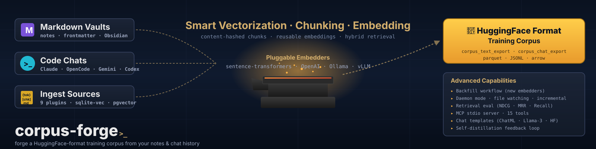

<picture>
  <source media="(prefers-color-scheme: dark)" srcset="assets/banner-dark.svg">
  <source media="(prefers-color-scheme: light)" srcset="assets/banner.svg">
  
</picture>

# corpus-forge

> **Forge a HuggingFace-format training corpus from your notes and chat history.**

[](https://github.com/ulmentflam/corpus-forge/actions/workflows/ci.yml)
[](https://github.com/ulmentflam/corpus-forge/actions/workflows/nightly.yml)
[](https://www.python.org/)
[](LICENSE)
[](https://github.com/ulmentflam/corpus-forge/releases)
[](https://github.com/astral-sh/ruff)
[](https://github.com/facebook/pyrefly)

## Why corpus-forge

- **Training data, not search.** The primary deliverable is a HuggingFace-Datasets-format export of your text + chat sources, deduplicated by content-hash, ready to feed a fine-tuning run.
- **Multi-embedder by design.** Register as many embedders as you want — local sentence-transformers, OpenAI, anything served via an OpenAI-compatible endpoint (Ollama, vLLM). Backfill new embedders without re-chunking.
- **Hybrid retrieval + MCP exposure are the secondary use case.** Once the corpus exists, expose it to Claude (or any MCP client) for grounded research. The retrieval-eval harness doubles as a corpus-quality signal.

## Quickstart

```bash
pip install corpus-forge[sqlite,hf]

# 1. Drop in a config (edit paths + embedder choices).
mkdir -p ~/.config/corpus-forge
cp $(python -c "import corpus_forge, pathlib; print(pathlib.Path(corpus_forge.__file__).parent.parent / 'config.example.toml')") \
   ~/.config/corpus-forge/config.toml
$EDITOR ~/.config/corpus-forge/config.toml

# 2. Initialize the database (SQLite or PostgreSQL).
corpus-forge migrate

# 3. Run a one-shot ingestion pass.
corpus-forge ingest --once

# 4. Export to HuggingFace Datasets format.
corpus-forge export hf --dataset my-vault
```

## Install

<details>
<summary><strong>Linux</strong></summary>

```bash
# 1. Install the package + the extras you need.
pip install 'corpus-forge[sqlite,hf]'
#   add [openai] for OpenAI embedders, [mcp] for the Claude MCP server,
#       [rerank] for the cross-encoder reranker, [eval] for the
#       retrieval-evaluation harness.

# 2. (Optional) Register a systemd user unit for the daemon.
bash scripts/linux/install.sh
# Writes ~/.config/systemd/user/corpus-forge.service and starts it
# via `systemctl --user enable --now corpus-forge.service`.

# 3. Configure + smoke-test.
cp config.example.toml  ~/.config/corpus-forge/config.toml
cp secrets.env.example ~/.config/corpus-forge/secrets.env
corpus-forge migrate
corpus-forge ingest --once
```

</details>

<details>
<summary><strong>macOS</strong></summary>

```bash
# 1. Install (same as Linux).
pip install 'corpus-forge[sqlite,hf]'

# 2. (Optional) Register a launchd agent for the daemon.
bash scripts/macos/install.sh
# Renders ~/Library/LaunchAgents/com.${USER}.corpus-forge.plist and
# prints the `launchctl load` / `launchctl kickstart` commands.

# 3. Configure + smoke-test.
cp config.example.toml  ~/.config/corpus-forge/config.toml
cp secrets.env.example ~/.config/corpus-forge/secrets.env
corpus-forge migrate
corpus-forge ingest --once
```

Apple Silicon: `device = "mps"` in the embedder config uses the GPU.

</details>

<details>
<summary><strong>Windows</strong></summary>

`pip install corpus-forge[sqlite,hf]` works under Python 3.11/3.12/3.13 on Windows. We don't ship a Windows service-installer script for beta — wrap `corpus-forge daemon` with [NSSM](https://nssm.cc/) or Task Scheduler:

```powershell
# Example with NSSM
nssm install corpus-forge "C:\Path\To\Python\python.exe" -m corpus_forge daemon
nssm set corpus-forge AppDirectory "%USERPROFILE%\.config\corpus-forge"
nssm start corpus-forge
```

PostgreSQL integration tests require Docker Desktop; SQLite-only setups work natively.

</details>

### Source install (developer mode)

```bash
git clone https://github.com/ulmentflam/corpus-forge
cd corpus-forge
make dev    # uv sync --all-extras --group dev + pre-commit install
make ci     # full local gate (format / lint / typecheck / tests)
```

## What you get — HF export

The headline payoff. Two views map directly to HuggingFace columns:

```bash
# Text export — one row per chunk, suitable for instruction-tuning prep.
corpus-forge export hf --dataset my-vault --view corpus_text_export

# Chat export — one row per conversation, ShareGPT-shaped messages list.
corpus-forge export hf --dataset claude-code --view corpus_chat_export
```

Or programmatically:

```python
from corpus_forge.exports.huggingface import export_to_hf_dataset, push_to_hub

ds = export_to_hf_dataset("corpus_text_export")
push_to_hub(ds, "username/my-personal-corpus")
```

| View | Columns |
|---|---|
| `corpus_text_export` | `id`, `text`, `source`, `title`, `heading`, `role`, `metadata`, `labels` |
| `corpus_chat_export` | `id`, `source`, `title`, `messages` (ShareGPT format), `metadata` |

## Hardware acceleration

| Platform | Backend | Embedder device |
|---|---|---|
| Linux + CUDA | `postgres` (pgvector) or `sqlite` (sqlite-vec) | `device = "cuda"` |
| macOS Apple Silicon | `postgres` or `sqlite` | `device = "mps"` |
| Linux/Windows CPU | either | `device = "cpu"` |
| Anywhere | sqlite-only, no GPU | `device = "cpu"` |

Set `device = "auto"` to let sentence-transformers pick.

## Optional extras

```bash
pip install 'corpus-forge[sqlite,openai,hf,tokens,retrieval,rerank,mcp,eval]'
```

| Extra | What it enables |
|---|---|
| `[sqlite]` | `sqlite-vec` virtual table for ANN search on SQLite. |
| `[openai]` | OpenAI embedders (also any OpenAI-compatible endpoint — Ollama, vLLM). |
| `[hf]` | `datasets` library for HF export. |
| `[tokens]` | `tiktoken` for token-aware chunking. |
| `[retrieval]` | NumPy-backed retrieval-evaluation primitives. |
| `[rerank]` | `sentence-transformers` cross-encoder rerankers (BGE default). |
| `[mcp]` | Model Context Protocol stdio server for Claude / Agent SDK clients. |
| `[eval]` | Bundled gold-set evaluation harness (NDCG / MRR / Recall). |

## Architecture

```
Sources → Chunkers → Orchestrator → Backend → per-embedder tables
   ↑          ↑           ↑            ↑
markdown   markdown   identity     Postgres/SQLite
claude     conversation  dedup     advisory locks
opencode               HF export  per-embedder tables
```

**Three protocols** define the entire extension surface:

| Protocol | Where | What it does |
|---|---|---|
| `Source` | `sources/base.py` | Discover + parse raw data into `RawDocument` / `RawConversation`. |
| `Embedder` | `embedders/base.py` | Map texts → vectors. Symmetric `encode` + asymmetric `encode_query`. |
| `StorageBackend` | `backends/base.py` | Persist chunks + vectors. Search dense + lexical. Cross-host sync. |

Common machinery lives in base classes: `WatchedSource` (file watching + debounce + identity + hash short-circuit), `Chunker` (size-bounding + overlap with forward-progress invariant), `BaseEmbedder` / `BaseBackend`.

## Configuration reference

See `config.example.toml` for the full reference. Key sections:

- `[backend]` — `kind` is `"postgres"` or `"sqlite"`; `dsn` is the Postgres connection string OR the SQLite file path. `schema = "corpus"` for Postgres; ignored on SQLite.
- `[daemon]` — `debounce_seconds`, `log_level`, `log_format`, `sync_poll_interval_s`, `trash_dir`, `conflict_dir`.
- `[[datasets]]` — repeated. `name`, `kind` (`text` | `chat`), `description`, `sync_enabled` (Postgres only — SQLite rejects `sync_enabled = true` at config-load).
- `[[datasets.sources]]` — repeated. `plugin` (`markdown_vault` | `claude_code` | `opencode`), source-specific paths, `chunker`, `chunker_config`.
- `[[embedders]]` — repeated. `name`, `provider` (`sentence_transformers` | `openai`), `model_id`, `dimension`, `normalize`, `distance`, `active`, `batch_size`, `device`, `api_key_env` (OpenAI only).
- `[retrieval]` — `fusion` (`rrf` | `alpha`), `alpha`, `default_k`, `rerank_top_n`, `rerank_enabled`, `reranker.{kind, model_id, device, ...}`.

## Run as a service

| OS | Script | Service manager |
|---|---|---|
| Linux | `scripts/linux/install.sh` | systemd user unit |
| macOS | `scripts/macos/install.sh` | launchd agent |
| Windows | (manual) | NSSM / Task Scheduler |

Inspect the rendered unit / plist under `packaging/` for reference. `make stop` and `make logs` dispatch on `uname -s`.

## Backfill workflow

To add an embedder to an existing corpus:

```toml
# 1. Add to config.toml — keep existing embedders active.
[[embedders]]
name      = "new-embedder"
provider  = "sentence_transformers"
model_id  = "new/model"
dimension = 1024
active    = true
```

```bash
# 2. Backfill just the new embedder against existing chunks.
corpus-forge embed --embedder new-embedder

# Or all active embedders in one pass:
corpus-forge embed
```

Chunks already have content-hashes; the backfill encodes only what's missing.

## Agent integration (MCP)

corpus-forge ships a stdio Model Context Protocol server that exposes three tools:

| Tool | Use |
|---|---|
| `search` | Hybrid (dense + lexical) search with optional rerank. Returns `{hits: [...]}` with `chunk_id`, `score`, `text`, `source_uri`, `title`, `dataset_id`. |
| `get_chunk` | Fetch a chunk by id. |
| `list_datasets` | Enumerate datasets with `chunk_count` / `document_count`. |

### Wire-up

```bash
pip install 'corpus-forge[mcp]'
corpus-forge mcp serve   # stdio transport (only transport in beta)
```

Drop-in MCP config snippets live under `examples/mcp-config/`:

- `claude-code.mcp.json` — for Claude Code (~/.config/claude-code/mcp.json or `.mcp.json` per-project).
- `claude-desktop.json` — for Claude Desktop (`~/Library/Application Support/Claude/claude_desktop_config.json` on macOS).

```json
{
  "mcpServers": {
    "corpus-forge": {
      "command": "corpus-forge",
      "args": ["mcp", "serve"],
      "env": { "CORPUS_FORGE_CONFIG": "~/.config/corpus-forge/config.toml" }
    }
  }
}
```

### First-class Claude assets

- **Project-scoped skill** — `.claude/skills/corpus-forge-search/SKILL.md` — instructs Claude Code on when to invoke the MCP tools and how to cite results.
- **Agent SDK subagent** — `.claude/agents/corpus-forge-researcher.md` — research-style delegate scoped to the three MCP tools.
- **Full walkthrough** — [`docs/claude-integration.md`](docs/claude-integration.md).

Rerank (`rerank=true`) triggers a one-time ~600 MB `BAAI/bge-reranker-v2-m3` download. Opt-in only for top-of-list precision needs.

## Local search

The same retrieval surface is available as a CLI:

```bash
corpus-forge search "how does the SQLite lock work" --k 5
corpus-forge search "phase B retrieval" --dataset planning --rerank --json
```

## Retrieval evaluation

The retrieval-eval harness doubles as a corpus-quality signal. Run NDCG@10 / MRR@10 / Recall@20 on a bundled gold set:

```bash
corpus-forge eval retrieval --dataset forge_self --k 10,20
corpus-forge eval corpus-quality --dataset /path/to/held-out-qa.jsonl
```

A drop in `recall@20` on your own held-out QA pairs is an early-warning signal that your chunking / embedder config regressed before you export the corpus for training.

## Development

```bash
make dev           # install dev deps + pre-commit hooks
make ci            # format-check + lint + typecheck + unit + fuzz + smoke
make test-unit     # parallel unit tests, coverage-gated ≥ 85%
make test-integration  # Docker-backed pgvector
make test-fuzz     # Hypothesis property tests
make test-smoke    # end-to-end happy paths
```

See [`CONTRIBUTING.md`](CONTRIBUTING.md) for branching + commit conventions + the PR gate.

## License + governance

- License: [**Apache 2.0**](LICENSE)
- Contributing: [`CONTRIBUTING.md`](CONTRIBUTING.md)
- Code of Conduct: [`CODE_OF_CONDUCT.md`](CODE_OF_CONDUCT.md) (Contributor Covenant 2.1)
- Security: [`SECURITY.md`](SECURITY.md) — do **not** open public issues for vulnerabilities; email `evan@qwerky.ai`.
- Changelog: [`CHANGELOG.md`](CHANGELOG.md)
